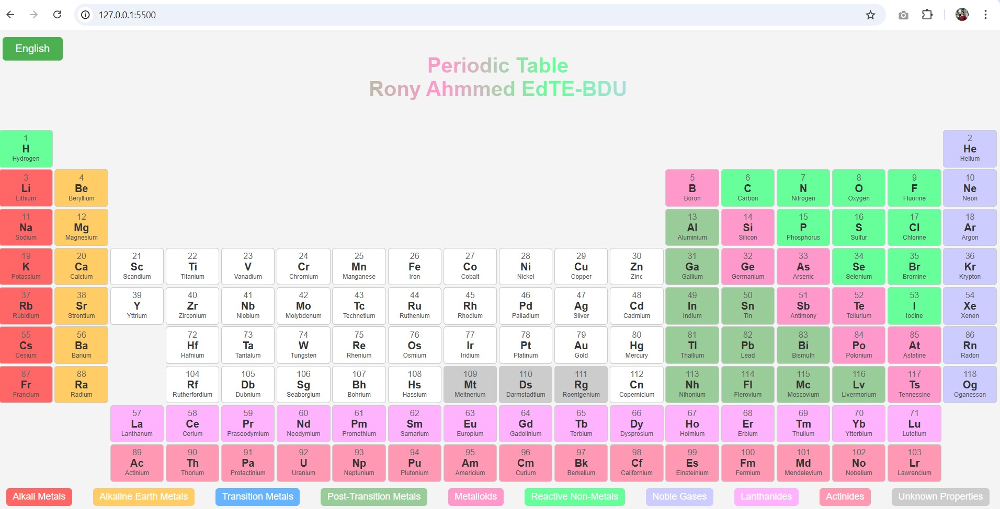

# Periodic Table

## Rony Ahmmed EdTE-BDU

পর্যায় সারণী হল পারমাণবিক সংখ্যা দ্বারা সংগঠিত রাসায়নিক উপাদানগুলির একটি সারণী বিন্যাস, সর্বনিম্ন পারমাণবিক সংখ্যা, হাইড্রোজেন থেকে সর্বোচ্চ পারমাণবিক সংখ্যা, ওগনেসন সহ মৌল পর্যন্ত। একটি মৌলের পারমাণবিক সংখ্যা হল সেই মৌলের একটি পরমাণুর নিউক্লিয়াসে প্রোটনের সংখ্যা। হাইড্রোজেনের আছে 1 প্রোটন, আর ওগেনেসনের আছে 118

[Live Version](https://rony7s.github.io/Periodic-Table/)
